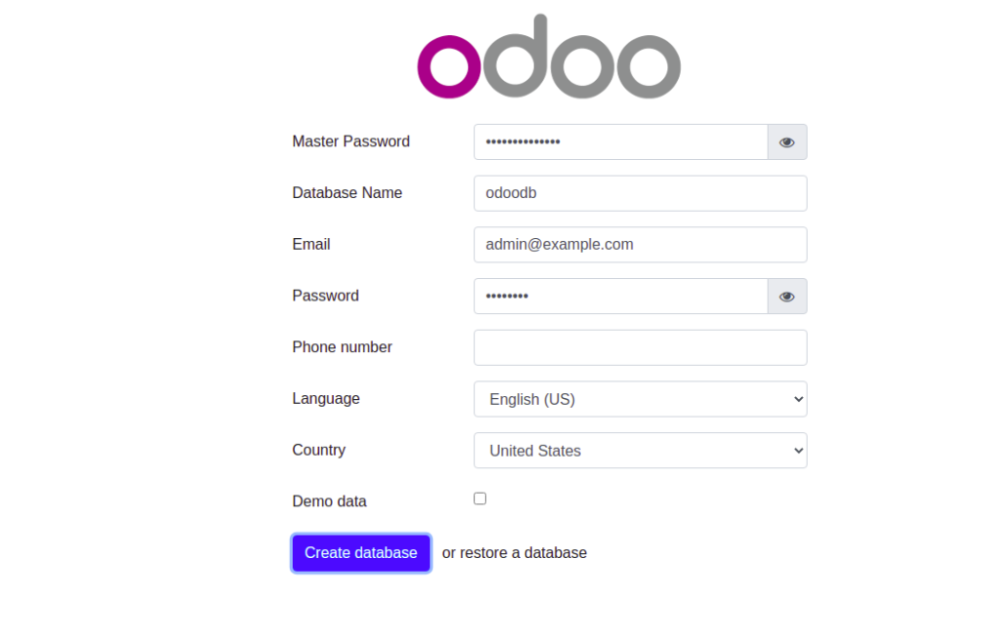
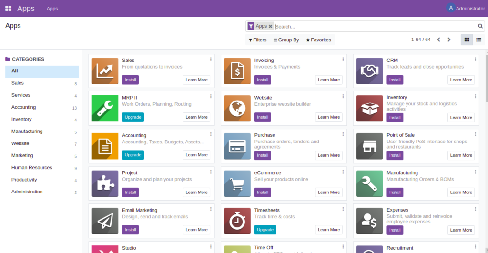

Instalção odoo 15 em sistemas ubuntu 20.04

# Faça login e atualize o servidor

$ sudo apt-get update -y && apt-get upgrade -y

# Instalar dependências necessárias

$ sudo apt-get install python3-pip python-dev python3-dev libxml2-dev libpq-dev libjpeg8-dev liblcms2-dev libxslt1-dev zlib1g-dev libsasl2-dev libldap2-dev build-essential git libssl-dev libffi-dev libmysqlclient-dev libjpeg-dev libblas-dev libatlas-base-dev -y

# Node.js e o NPM

$ sudo apt-get install npm
$ sudo npm install -g less less-plugin-clean-css
$ sudo apt-get install node-less

# Pacote wkhtmltopdf

$ sudo wget https://github.com/wkhtmltopdf/packaging/releases/download/0.12.6-1/wkhtmltox_0.12.6-1.bionic_amd64.deb 
$ sudo dpkg -i wkhtmltox_0.12.6-1.bionic_amd64.deb
$ sudo apt-get install -f

# Instale o PostgreSQL

$ sudo apt-get install postgresql -y

# Depois que o PostgreSQL estiver instalado, faça login no PostgreSQL e crie um usuário Odoo com o seguinte comando:

$ su - postgres
$ createuser --createdb --username postgres --no-createrole --no-superuser --pwprompt odoo15
$ psql
$ ALTER USER odoo15 WITH SUPERUSER;

# Em seguida, saia do PostgreSQL com o seguinte comando:

$ \q

$ exit

# Instalar e configurar o Odoo 15 (criando usuario odoo)

$ useradd -m -d /opt/odoo15 -U -r -s /bin/bash odoo15

# Em seguida, mude o usuário para o Odoo 15 e baixe o Odoo 15 do repositório Git

$ su - odoo15
$ git clone https://www.github.com/odoo/odoo --depth 1 --branch 15.0 /opt/odoo15/odoo

# saia do usuário do Odoo 15 e instale todas as dependências necessárias do Python

$ exit
$ pip3 install -r /opt/odoo15/odoo/requirements.txt

# copie o arquivo de configuração de amostra do Odoo 15 para o diretório /etc

$ cp /opt/odoo15/odoo/debian/odoo.conf /etc/odoo.conf

# Em seguida, edite o arquivo de configuração do Odoo 15 usando seu editor favorito

$ nano /etc/odoo.conf

# Altere as seguintes linhas:

[opções]
   ; Esta é a senha que permite as operações do banco de dados:
   admin_passwd = senha mestra
   db_host = False
   db_port = False
   db_user = odoo15
   db_password = False
   xmlrpc_interface = 127.0.0.1
   proxy_mode = Verdadeiro
   addons_path = /opt/odoo15/odoo/addons
   arquivo de log = /var/log/odoo/odoo.log

# Salve e feche o arquivo e defina a propriedade adequada para o arquivo de configuração do Odoo 15.

$ chown odoo15: /etc/odoo.conf

# Crie um diretório de log para o Odoo 15 e defina a propriedade adequada

$ mkdir /var/log/odoo
$ chown odoo15:root /var/log/odoo

# Você precisará criar um arquivo de serviço systemd para gerenciar o serviço Odoo 15

$ nano /etc/systemd/system/odoo15.service

# Salve e feche o arquivo e recarregue o daemon systemd para aplicar as alterações

$ systemctl daemon-reload

# Inicie e ative o serviço Odoo 15

$ systemctl start odoo15
$ systemctl enable odoo15

# verificar o status do serviço Odoo 15

$ systemctl status odoo15

*  Output:

 odoo15.service - Odoo
     Loaded: loaded (/etc/systemd/system/odoo15.service; disabled; vendor preset: enabled)
     Active: active (running) since Mon 2021-10-11 10:35:36 UTC; 5s ago
       Docs: http://www.odoo.com
   Main PID: 21021 (python3)
      Tasks: 4 (limit: 4691)
     Memory: 66.9M
     CGroup: /system.slice/odoo15.service
             └─21021 python3 /opt/odoo15/odoo/odoo-bin -c /etc/odoo.conf
Oct 11 10:35:36 ubuntu2004 systemd[1]: Started Odoo.

# É sempre uma boa ideia configurar o Nginx como um proxy reverso para o Odoo

# instale o pacote Nginx 

$ apt-get install nginx -y

# crie um arquivo de configuração de host virtual Nginx

$ nano /etc/nginx/conf.d/odoo15.conf

# Adicione a seguinte configuração

upstream odoo {
 server 127.0.0.1:8069;
}
upstream odoochat {
 server 127.0.0.1:8072;
}
server {
 listen 80;
 server_name odoo15.example.com;
 proxy_read_timeout 720s;
 proxy_connect_timeout 720s;
 proxy_send_timeout 720s;
 # Add Headers for odoo proxy mode
 proxy_set_header X-Forwarded-Host $host;
 proxy_set_header X-Forwarded-For $proxy_add_x_forwarded_for;
 proxy_set_header X-Forwarded-Proto $scheme;
 proxy_set_header X-Real-IP $remote_addr;
 # log
 access_log /var/log/nginx/odoo.access.log;
 error_log /var/log/nginx/odoo.error.log;
 # Redirect longpoll requests to odoo longpolling port
 location /longpolling {
 proxy_pass http://odoochat;
 }
 # Redirect requests to odoo backend server
 location / {
   proxy_redirect off;
   proxy_pass http://odoo;
 }
 # common gzip
 gzip_types text/css text/scss text/plain text/xml application/xml application/json application/javascript;
 gzip on;
}

# Salve e feche o arquivo e reinicie o Nginx para aplicar as alterações

$ systemctl reinicie o nginx

*** Acesse a instância do Odoo 15 ***

Agora, quando você sabe que a nova instalação do Odoo está ativa e em execução no servidor, você pode acessá-la usando a URL http://odoo15.example.com . Se a instalação foi concluída com sucesso, você poderá ver a tela Odoo conforme mostrado abaixo e criar seu primeiro banco de dados:

<h1 align="center">
    
</h1>

A partir daqui, basta digitar sua senha mestra e preencher os campos com as informações necessárias para o seu caso de uso. Em seguida, clique no botão Criar banco de dados . Você deve ver o painel Odoo15:

<h1 align="center">
    
</h1>

